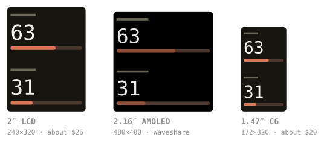
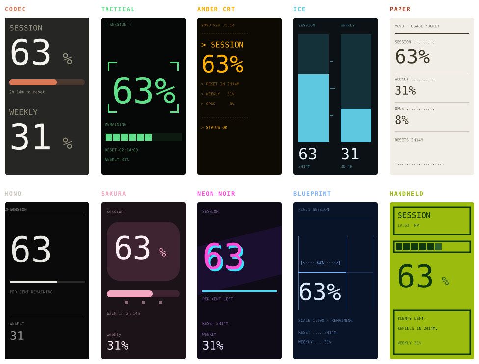

# Yoyu よゆう

*yoyū* — Japanese for **room to spare**. A tiny desk gadget that shows your
**Claude usage limits** at a glance: how much you have left in each window, when
it resets, and a phone alert when you're running low. No terminal, no menubar,
no estimating.

Built on one **~$26 [Waveshare ESP32-S3-Touch-LCD-2](https://www.waveshare.com/esp32-s3-touch-lcd-2.htm)**
with screen, touch, battery header and USB-C all on it. No Raspberry Pi, no
Linux, no soldering. Two other boards are supported, including a smaller one at
about $20. See [Buy the hardware](#buy-the-hardware).

  
  
  

Meters · Focus · the kitsune, down to one tail. Tap to cycle.

The kitsune is one of five characters; the others are a moon, a candle, a plant and a cat.

## Before you buy: you need Claude Code

The board shows **Claude Code's** usage limits, and it gets them by reading
Claude Code's own login. There's no API key to paste and no account to create.
So it needs, on the computer you set it up from:

- **Claude Code installed and signed in.** Claude Code comes with the paid
  Claude plans (Pro and Max) and isn't part of the free tier, so a free account
  leaves the board with no login to read.
- **One pairing, once.** After that the board reads your usage on its own over
  Wi-Fi and tops itself up from your computer whenever that's on. Switch the
  computer off for more than a few hours and the board pauses until you're
  back. It's handed a short-lived token it deliberately can't renew, so that it
  can never sign *you* out of Claude Code. (Pairing hands it that login, so Claude
  Code has to be signed in first.)

If `claude` runs on your machine and you're signed in, you're good.

## Buy the hardware

Three boards work, and all of them flash from the browser. The setup page asks
which one you have before it writes anything, because the image and the panel
have to match.

  

True relative sizes. The C6 is meant to sit sideways;
it is shown upright here so the three can be compared.

**[Waveshare ESP32-S3-Touch-LCD-2](https://www.waveshare.com/esp32-s3-touch-lcd-2.htm)**
2", 240×320, about $26. The reference board: every screen is drawn against this
panel first, and touch works.
[on Amazon](https://www.amazon.com/dp/B0DTTL56ZR?tag=daveeuson01-20) ·
[direct from Waveshare](https://www.waveshare.com/esp32-s3-touch-lcd-2.htm)

**[Waveshare ESP32-S3-Touch-AMOLED-2.16](https://www.waveshare.com/esp32-s3-touch-amoled-2.16.htm)**
2.16", 480×480, square. Brighter, and true black instead of backlit, so it
starts on the dimmer theme and draws the same layout bigger instead of fitting
more in. It boots, joins Wi-Fi, shows every screen and reads your usage.

> **Touch does not work on the unit I have.** You cannot tap the screen, but
> the keys on its edge step through the screens: the left one goes back and
> BOOT goes forward. PWR, between them, is the board's power switch -- hold it
> and the board turns off -- so nothing is bound to it. Everything else is
> configured from a browser.
>
> It is a fault in the panel module, not in Yoyu: Waveshare's own touch driver
> behaves identically on the same board, and neither reflashing nor reseating
> the connector is expected to help. [Why, in detail](docs/TROUBLESHOOTING.md#touch-does-nothing-on-the-amoled-board)

**[Waveshare ESP32-C6-LCD-1.47](https://www.waveshare.com/esp32-c6-lcd-1.47.htm)**
1.47", 172×320, about $20. The cheapest way in. A narrow panel is no place for
nine screens, so it opens on two -- what is left, and whether you will run out
before it resets -- drawn as large as the glass allows, and it sits sideways on
a desk. There is a colour LED under the acrylic that tracks your headroom:
green, amber, red.
[on Amazon](https://www.amazon.com/dp/B0DHTMYTCY?tag=daveeuson01-20) ·
[direct from Waveshare](https://www.waveshare.com/esp32-c6-lcd-1.47.htm)

> **No touch on this board at all** -- there is no touch layer to fail. The
> screens change on a timer and everything else is set from a browser. It is
> also a different chip family (RISC-V, no PSRAM) with 4MB of flash, so it
> carries its own partition table and its own firmware image.

*As an Amazon Associate I earn from qualifying purchases.*

## Get one running

No tools, no command line:

1. **Flash it in your browser.** Open **https://daveeuson.github.io/Yoyu/**
   in Chrome or Edge, pick which board you have, plug it in over USB-C, and
   click **Connect & Install**.
2. **Set Wi-Fi in the same window.** It hands the board your network over the
   same USB cable (Improv). No hotspot, no typing an address.
3. **See your usage.** Download the companion app from that page and open it.
   It finds the board on your network and feeds it your real usage, or you can
   pair the board so it fetches your usage itself (below).
4. **Install it, if you want it permanent.** Run it once with `--install`, or
   pick **Install on this computer** from the tray menu. That copies the app
   somewhere stable, adds it to your applications menu, and offers to start it
   when you log in. Without this it runs from wherever you downloaded it, and
   emptying that folder stops it coming back.

## Running more than one

Several boards on one network is a supported setup, not a workaround. The
companion finds every board and feeds them all from a single read of your
usage, and the tray gives each one its own submenu.

Two things are per board rather than shared: **pairing** (each holds its own
top-up key, so pair each one you want to run without this computer) and
**`yoyu.local`**, which only ever names one of them. The others come up as
`yoyu-2.local`, `yoyu-3.local` and so on, in the order they start, and those
names can swap when they reboot together. Each board prints its own permanent id at the bottom of the
page it serves at its own address.

If you add another board later you do not have to do anything. A running
companion looks for boards it has not seen every 15 minutes, picks up anything
new, and says so. `--rescan` and the tray's **Look for boards** still force it
if you would rather not wait. Set `rescan_secs` in the config to change the
interval, or to `0` to stop it looking.

## Turning it off again

Pairing a board takes one click; so does undoing it. **Disconnect from Claude**
sits in the companion's tray menu beside **Pair board**, and on the board's own
`/settings` page. It clears the login and revokes the key your computer uses to
top the board up. Wi-Fi, theme, character, screens and history all stay. From
the command line, `companion.py --disconnect`.

## How it gets your usage

- **Companion app (easiest).** A small app on the computer where you use Claude
  Code. It reuses your existing Claude login to read your **real** numbers, the
  same ones `claude /usage` shows, and pushes them to the board. Double-click
  and forget: it auto-finds the board and starts with your computer. (It never
  does a fresh sign-in, so it avoids the throttle that blocks third-party
  logins.)
- **Paired (the board fetches its own).** Run the companion once with
  `--pair`; the board shows a short confirmation code on its screen, you type it
  in, and only then does it take your login, so the token goes to the physical
  device in front of you and not to whatever answered first on the network. The
  board then reads Anthropic itself instead of waiting to be sent your numbers.
  It still needs your computer now and then: the token it holds is short-lived
  and it deliberately cannot renew it, so the companion tops it up while the
  computer is on. Leave the computer off for more than a few hours and the board
  shows **waiting for your computer** until it is back.

## What it does

- **Meters** for every usage window Claude reports (5-hour session, weekly,
  weekly Opus…), fuel-gauge style. Amber under 30% left, red under 10%.
- **Reset countdowns** and a clock.
- **Pace.** Whether you will run out before each window resets, at the rate
  you are going, in the same terms as Claude's own usage panel: "Weekly runs
  out Wed 9 AM." The week is judged by your average since it started; the
  session by the last hour, because five hours is short enough that what you
  are doing now decides it. This is Yoyu's own calculation, since Anthropic's
  usage data carries no forecast, so it can differ from Claude's panel.
- **Usage credits**, once you go past your plan limits and start spending them.
  The money goes where the percentage does, plus a phone alert the first time a
  period tips over. It only appears when credits are actually being spent;
  having them available is a fact about your account, not about today.
- **Ten screens**, cycled by a tap, the AMOLED's keys, or a timer: meters, micro, focus, pace,
  history, your character, a timer, actions, projects and settings. The setup
  page shows each one and what it is for, so you can pick them before the
  board is even on your desk, and any of them can be switched off later.
- **Five characters**, and each one is a gauge. Every one shows how much
  headroom is left, in its own way. The **kitsune** fans out one to
  three tails; the **moon** waxes through its phase; the **candle** burns
  down; the **plant** grows; the **cat** gets a bigger ball of yarn. Four of
  the five are continuous, so 47% looks like 47% instead of rounding into a
  bucket. Pick one on the board's settings page.
- **Thirteen themes over ten layouts.** A theme is a palette *and* a layout:
  the screens that show your headroom are drawn a different way in each. Set
  from the board's own settings page, which previews all thirteen.

  

The ten layouts. Nord and Tokyo Night reuse Codec, which
is what makes thirteen themes out of ten.

- **Touch & motion.** Tap to cycle screens, long-press to flip % left / %
  used, swipe for brightness; flip it face-down to sleep, shake to wake.
  (2" LCD board only. The AMOLED's touch does not work, so its edge keys do
  the same job: a tap steps through the screens, a hold flips % left / % used.
  The C6 has neither, so it changes on a timer.)
- **Battery gauge** from the LiPo header.
- **Phone alerts** via ntfy or Pushover when a window crosses a threshold, with
  a recovery notice. There's also one the first time a period starts spending
  usage credits, and one if the spend limit is reached. Those two aren't tied to the
  percentage: the useful moment is the first cent, whatever the cap is.
- **A tray icon that matches your board.** Whichever of the five characters you
  picked, tinted green while it's feeding and red when it's stuck.

## Security

- **Verified TLS.** Every connection to Anthropic, GitHub, and the alert
  providers checks certificates against a pinned set of root CAs (no
  `setInsecure()`), so a network attacker can't intercept your Claude token or
  spoof a response.
- **Signed updates.** OTA images are verified against a public key baked into
  the firmware before flashing; an unsigned or tampered image is refused and the
  board stays on its known-good version.
- **Confirmed pairing.** Handing the board your login requires a one-time code
  shown on its screen, so the token only ever goes to the physical device in
  front of you, not to whatever won the network discovery race.

Designed for a trusted home or office network. Details and threat model in
[`docs/HARDENING.md`](docs/HARDENING.md).

## Troubleshooting

Full guide: [`docs/TROUBLESHOOTING.md`](docs/TROUBLESHOOTING.md). The common ones:

- **"Waiting for your computer"** is normal. The board's access token has run
  out and only the companion can mint another; open it (or just log in, if it
  starts at login) and the board catches up within a couple of minutes.
- **"Login expired – re-pair"** means firmware older than v1.6.3 signed itself in
  and rotated the token your computer was using, logging one of you out about
  once a day. Update the board at `/update`, then pair once more; it can't
  happen after that.
- **"Couldn't reach the board" / 404, or no pairing code** is usually two devices
  answering to `yoyu.local` (e.g. an old Pi still running). Turn off the one
  you're not using, or point the companion straight at the board with
  `--pi http://<board-ip>:8080`.
- **"Rate limited"** means more than one device polling the same account. Leave one
  running and wait out the countdown.

## Repo layout

- **`firmware/`** is the ESP32 firmware (PlatformIO). Board pinout, day-1
  runbook, and roadmap in [`firmware/README.md`](firmware/README.md).
- **`companion/`** is the desktop app that feeds the board. See
  [`companion/README.md`](companion/README.md).
- **`docs/`** holds the browser-flasher setup page (served by GitHub Pages), the
  [troubleshooting guide](docs/TROUBLESHOOTING.md), and the release checklist
  ([`docs/RELEASE.md`](docs/RELEASE.md)). Everything in it is public.
- **`design/`** holds the browser mock-ups the screens were designed in, and
  the script that draws this README's pictures from them. See
  [`design/README.md`](design/README.md).

## Build from source (developers only)

Buyers never need this; they use the browser flasher above. To change the
firmware: install [VS Code](https://code.visualstudio.com/) + the **PlatformIO**
extension, open the `firmware/` folder, and hit **Upload**. Full runbook in
[`firmware/README.md`](firmware/README.md).

## The Raspberry Pi version

The original, deluxe build (a Raspberry Pi Zero 2 W with a full web dashboard
and the "Pip" mascot) lives in its own repo, **YoyuZero**. This repo is the
self-contained ESP32 appliance.

## License

MIT. See [`LICENSE`](LICENSE). Made by Dave Euson with love in San Diego.
© 2026 Dave Euson.
