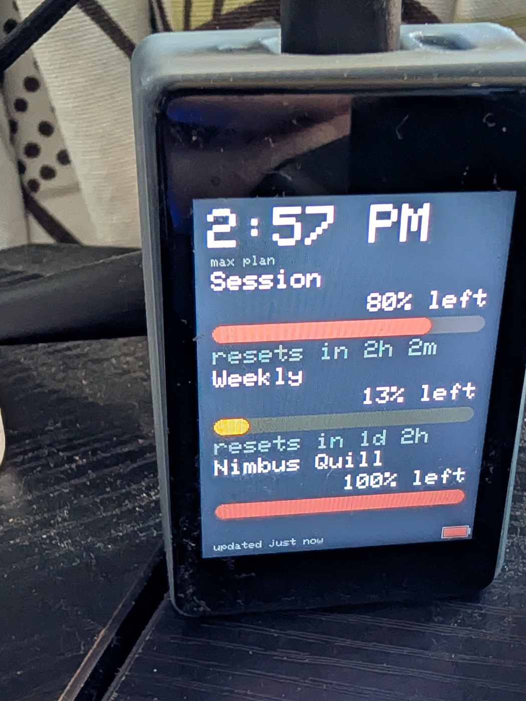
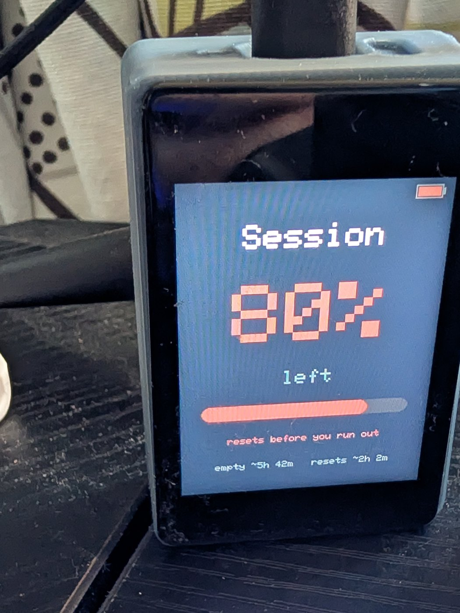
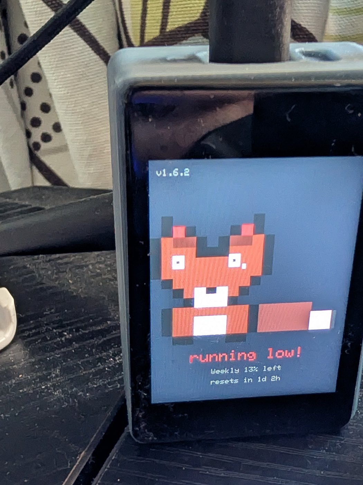

# Yoyu よゆう

*yoyū* — Japanese for **room to spare**. A tiny desk gadget that shows your **Claude usage limits** at a glance — how
much you have left in each window, when it resets, and a phone alert when you're
running low. No terminal, no menubar, no estimating.

Built on a **~$26 [Waveshare ESP32-S3-Touch-LCD-2](https://www.waveshare.com/esp32-s3-touch-lcd-2.htm)** —
one board with the screen, touch, battery header, and USB-C all on it. No
Raspberry Pi, no Linux, no soldering.

  
  
  

Meters · Focus · the kitsune, down to one tail — tap to cycle

## Before you buy: you need Claude Code

The board shows **Claude Code's** usage limits, and it gets them by reading
Claude Code's own login — there's no API key to paste and no account to create.
So it needs, on the computer you set it up from:

- **Claude Code installed and signed in.** Claude Code comes with the paid
  Claude plans (Pro and Max) and isn't part of the free tier — so a free
  account leaves the board with no login to read.
- **One pairing, once.** After that the board reads your usage on its own over
  Wi-Fi and tops itself up from your computer whenever that's on. Switch the
  computer off for more than a few hours and the board pauses until you're back
  — it's handed a short-lived token it deliberately can't renew, so that it can
  never sign *you* out of Claude Code. (Pairing hands it that login, so Claude
  Code has to be signed in first.)

If `claude` runs on your machine and you're signed in, you're good.

## Buy the hardware

Everything runs on the one ~$26 board — no Raspberry Pi, no soldering.

- **Waveshare ESP32-S3-Touch-LCD-2:**
  [on Amazon](https://www.amazon.com/dp/B0DTTL56ZR?tag=daveeuson01-20) ·
  [direct from Waveshare](https://www.waveshare.com/esp32-s3-touch-lcd-2.htm)

**Coming soon: a bigger screen.** Support for the
[Waveshare ESP32-S3-Touch-AMOLED-2.16](https://www.waveshare.com/esp32-s3-touch-amoled-2.16.htm)
(2.16", 480×480 AMOLED) is being built — pins, display driver and build target
are already in the firmware. **Don't buy one yet:** no image is published for it
and the flasher above only offers the 2" LCD board, so there is nothing to
install on it today. This page will say so when there is.

*As an Amazon Associate I earn from qualifying purchases.*

## Get one running

No tools, no command line:

1. **Flash it in your browser.** Open **https://daveeuson.github.io/Yoyu/**
   in Chrome or Edge, plug the board in over USB-C, and click
   **Connect & Install**.
2. **Set Wi-Fi in the same window** — it hands the board your network over the
   same USB cable (Improv). No hotspot, no typing an address.
3. **See your usage.** Download the companion app from that page and open it —
   it finds the board on your network and feeds it your real usage. Or make the
   board self-contained (below).

## How it gets your usage

- **Companion app (easiest).** A small app on the computer where you use Claude
  Code. It reuses your existing Claude login to read your **real** numbers — the
  same ones `claude /usage` shows — and pushes them to the board. Double-click
  and forget: it auto-finds the board and starts with your computer. (It never
  does a fresh sign-in, so it avoids the throttle that blocks third-party
  logins.)
- **Self-contained (no computer).** Run the companion once with `--pair`; the
  board shows a short confirmation code on its screen, you type it in, and only
  then does it take your login — so the token goes to the physical device in
  front of you, not to whatever answered first on the network. The board then
  polls Anthropic directly and refreshes its own token — nothing runs on your
  computer afterward.

## What it does

- **Meters** for every usage window Claude reports (5-hour session, weekly,
  weekly Opus…), fuel-gauge style — amber under 30% left, red under 10%.
- **Reset countdowns** and a clock.
- **Three screens**, cycled by a tap: all meters → one big focus meter → a
  usage-history graph (kept in flash across reboots).
- **Touch & motion** — tap to cycle screens, long-press to flip % left / %
  used, swipe for brightness; flip it face-down to sleep, shake to wake.
- **Battery gauge** from the LiPo header.
- **Phone alerts** via ntfy or Pushover when a window crosses a threshold, with
  a recovery notice.

## Security

- **Verified TLS** — every connection to Anthropic, GitHub, and the alert
  providers checks certificates against a pinned set of root CAs (no
  `setInsecure()`), so a network attacker can't intercept your Claude token or
  spoof a response.
- **Signed updates** — OTA images are verified against a public key baked into
  the firmware before flashing; an unsigned or tampered image is refused and the
  board stays on its known-good version.
- **Confirmed pairing** — handing the board your login requires a one-time code
  shown on its screen, so the token only ever goes to the physical device in
  front of you — not to whatever won the network discovery race.

Designed for a trusted home or office network. Details and threat model in
[`docs/HARDENING.md`](docs/HARDENING.md).

## Troubleshooting

Full guide: [`docs/TROUBLESHOOTING.md`](docs/TROUBLESHOOTING.md). The common ones:

- **"Waiting for your computer"** — normal. The board's access token has run
  out and only the companion can mint another; open it (or just log in, if it
  starts at login) and the board catches up within a couple of minutes.
- **"Login expired – re-pair"** — firmware older than v1.6.3 signed itself in
  and rotated the token your computer was using, logging one of you out about
  once a day. Update the board at `/update`, then pair once more; it can't
  happen after that.
- **"Couldn't reach the board" / 404, or no pairing code** — usually two devices
  answering to `yoyu.local` (e.g. an old Pi still running). Turn off the one
  you're not using, or point the companion straight at the board with
  `--pi http://<board-ip>:8080`.
- **"Rate limited"** — more than one device polling the same account. Leave one
  running and wait out the countdown.

## Repo layout

- **`firmware/`** — the ESP32 firmware (PlatformIO). Board pinout, day-1
  runbook, and roadmap in [`firmware/README.md`](firmware/README.md).
- **`companion/`** — the desktop app that feeds the board. See
  [`companion/README.md`](companion/README.md).
- **`docs/`** — the browser-flasher setup page (served by GitHub Pages), the
  [troubleshooting guide](docs/TROUBLESHOOTING.md), and the release checklist
  ([`docs/RELEASE.md`](docs/RELEASE.md)).

## Build from source (developers only)

Buyers never need this — they use the browser flasher above. To change the
firmware: install [VS Code](https://code.visualstudio.com/) + the **PlatformIO**
extension, open the `firmware/` folder, and hit **Upload**. Full runbook in
[`firmware/README.md`](firmware/README.md).

## The Raspberry Pi version

The original, deluxe build — a Raspberry Pi Zero 2 W with a full web dashboard
and the "Pip" mascot — lives in its own repo, **YoyuZero**. This repo is the
self-contained ESP32 appliance.

## License

MIT — see [`LICENSE`](LICENSE). Made by Dave Euson with love in San Diego.
© 2026 Dave Euson.
